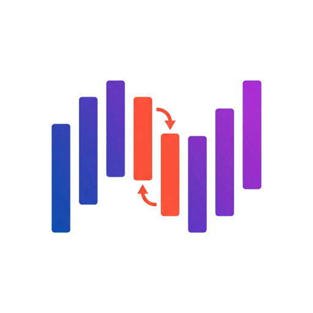

  

<h1 align="center">Algorithms</h1>

  An interactive web application for visualizing and learning sorting algorithms.
   
  Built with Phoenix LiveView.

  <a href="https://algorithms.fly.dev">Live Demo</a>

---

## Overview

Algorithms is an educational tool that helps developers and students understand how sorting algorithms work through real-time visualizations. Watch algorithms sort data step by step, compare their performance, and explore implementation details in multiple programming languages.

## Features

**Visualizer** - Watch sorting algorithms in action with animated bar charts. Control speed, array size, and data distribution.

**Learn** - Comprehensive documentation for each algorithm including history, complexity analysis, step-by-step breakdowns, and when to use them.

**Code Examples** - Implementation examples in Python, JavaScript, Go, and Rust with syntax highlighting.

**Multi-language Support** - Available in English and Portuguese.

## Algorithms

| Algorithm | Best | Average | Worst | Space | Stable |
|-----------|------|---------|-------|-------|--------|
| Insertion Sort | O(n) | O(n²) | O(n²) | O(1) | Yes |
| Selection Sort | O(n²) | O(n²) | O(n²) | O(1) | No |
| Bubble Sort | O(n) | O(n²) | O(n²) | O(1) | Yes |
| Shell Sort | O(n log n) | O(n^1.3) | O(n²) | O(1) | No |
| Merge Sort | O(n log n) | O(n log n) | O(n log n) | O(n) | Yes |
| Heap Sort | O(n log n) | O(n log n) | O(n log n) | O(1) | No |
| Quick Sort | O(n log n) | O(n log n) | O(n²) | O(log n) | No |
| Quick3 Sort | O(n) | O(n log n) | O(n²) | O(log n) | No |

## Tech Stack

- **Backend**: Elixir, Phoenix Framework, Phoenix LiveView
- **Frontend**: Tailwind CSS, daisyUI, highlight.js
- **Deployment**: Fly.io, Docker

